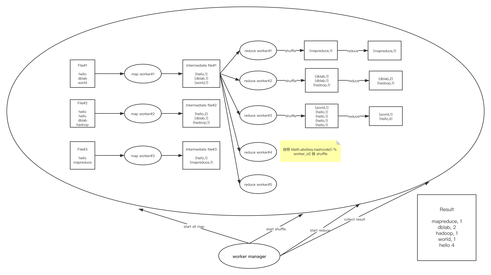

# mapreduce mini
一个极简 <del>简陋</del> 的 mapreduce 框架


## word count 演示，
直接运行 `WordCounrBoorstrap` 即可

预期结果
```
start register worker
end register worker
start all map worker
end all map worker
start all reduce worker
end all reduce worker
start generate result~
collect [Pair{key='mapreduce', val=ResultObj{val=1}}]
collect [Pair{key='dblab', val=ResultObj{val=2}}, Pair{key='hadoop', val=ResultObj{val=1}}]
collect [Pair{key='world', val=ResultObj{val=1}}, Pair{key='hello', val=ResultObj{val=4}}]
collect []
collect []
Pair{key='mapreduce', val=ResultObj{val=1}}
Pair{key='dblab', val=ResultObj{val=2}}
Pair{key='hadoop', val=ResultObj{val=1}}
Pair{key='world', val=ResultObj{val=1}}
Pair{key='hello', val=ResultObj{val=4}}
```

## 使用方式

1. 重写 `MapWorker` and `ReduceWorker`，分别继承 `DefaultMapWorker` 和 `DefaultReduceWorker`，分别按照自己的逻辑重写 `map` 和 `reduce` 方法；参考 `word_count/WCMapWorker` 和 `word_count/WCReduceWorker` 

2. 配置启动方法

```java
public class Bootstrap {
    public static void main(String[] args) {
        List<String> fileList = new ArrayList<>();
        String filePrefix = "/Users/bytedance/code/mapreduce_easy_frame/src/main/java/com/ayang818/mapreduce_frame_mini/data/";
        int fileNum = 3;
        for (int i = 1; i <= fileNum; i++) {
            fileList.add(String.format("%sfile%d.txt", filePrefix, i));
        }
        List<Pair> res = new WorkerManager(fileList, WCMapWorker.class, WCReduceWorker.class).start();
        res.forEach(System.out::println);
    }
}
```

核心代码在 

```
List<Pair> res = new WorkerManager(文件List, MapWorker类, ReduceWorker类).start();
```

默认 MapWorkerNum 和 ReduceWorkerNum 都为 3，可自行配置。

## 整体示例架构如下



TODO：找出目前所有的阻塞点，放到线程池里异步化~，

迭代方案：

其实只需要把 单机多进程中对其他worker的请求改造成走rpc形式即可，可以考虑走切面